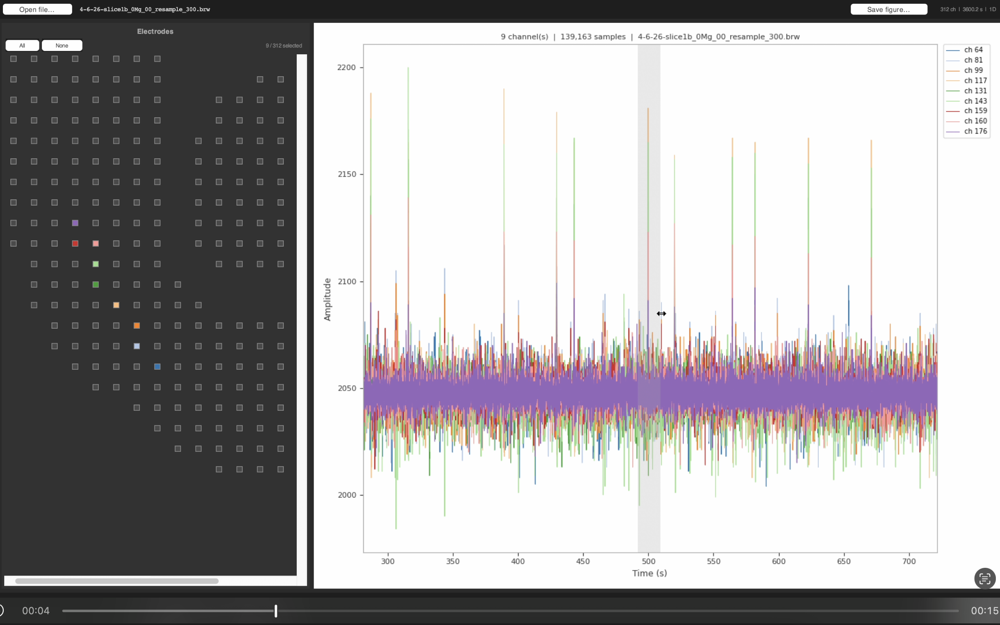
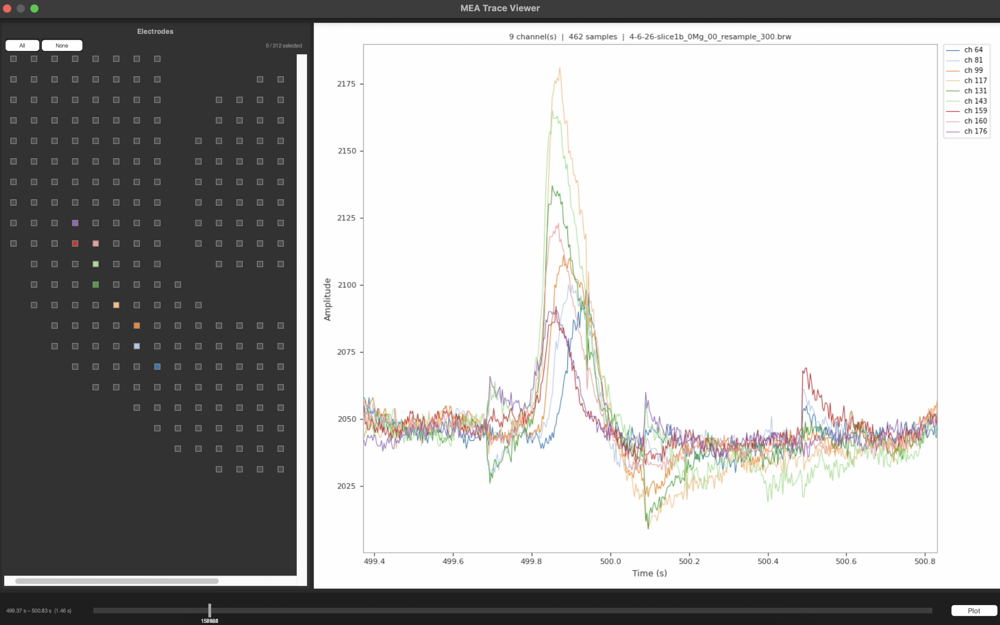

# MEA Trace Viewer

A lightweight Tkinter GUI for fast visualization of high-density MEA (Multi-Electrode Array) `.brw` / HDF5 recordings.
Designed specifically for exploring and characterizing ictal discharges and spatio-temporal activity patterns.


*Left: Electrode grid with click-to-select interface. Right: Corresponding color voltage traces.*

*Zoomed-in view showing individual spikes. Time range is adjusted via drag selection or the dual-handle slider below.*

## Features

- Spatial electrode grid based on physical channel layout
- Click-to-select electrodes
- Embedded matplotlib trace viewer
- Dual-handle time-range slider
- Save plots as PNG

## Dependencies

```bash
pip install numpy matplotlib h5py
```

## Run
Open Normally
```bash
python mea_gui.py
```

Or with a recording
```bash
python mea_gui.py recording.brw
```
