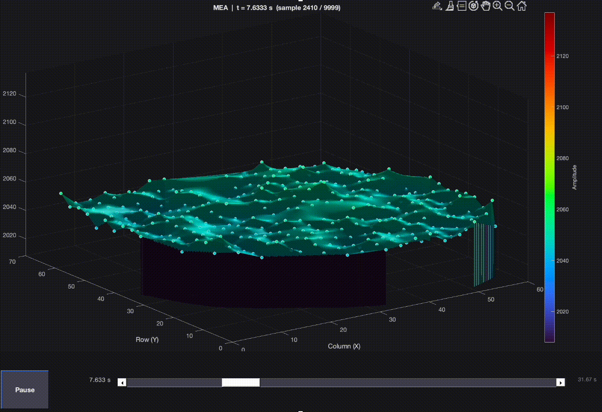

# MEA Analysis Toolkit
Tools for visualization and exploratory analysis of high-density multi-electrode array recordings.

## MEA Trace Viewer

A lightweight Tkinter GUI for fast visualization of high-density MEA (Multi-Electrode Array) `.brw` / HDF5 recordings.
Designed specifically for exploring and characterizing ictal discharges and spatio-temporal activity patterns.


*Left: Electrode grid with click-to-select interface. Right: Corresponding color voltage traces.*

*Zoomed-in view showing individual spikes. Time range is adjusted via drag selection or the dual-handle slider below.*

## Features

- Spatial electrode grid based on physical channel layout
- Click-to-select electrodes
- Embedded matplotlib trace viewer
- Dual-handle time-range slider
- Save plots as PNG

## Dependencies

```bash
pip install numpy matplotlib h5py
```

## Run
Open Normally
```bash
python mea_gui.py
```

Or with a recording
```bash
python mea_gui.py recording.brw
```


## 3D Surface Plot

Also included is a MATLAB tool for visualizing activity across the entire MEA as a 3D surface.

Rather than displaying individual voltage traces, the script reconstructs electrode activity over the array and renders it as an interpolated spatial surface. This can make it easier to observe seizure propagation, traveling waves, localized activity, and other spatiotemporal patterns.


*Animated spatial reconstruction of MEA activity across the electrode array.*

### Features

- Smooth spatial interpolation between electrodes
- Optional electrode markers
- Interactive playback controls
- Automatic outlier rejection for noisy channels

Run from MATLAB:

```matlab
mea_surface_plot
```
